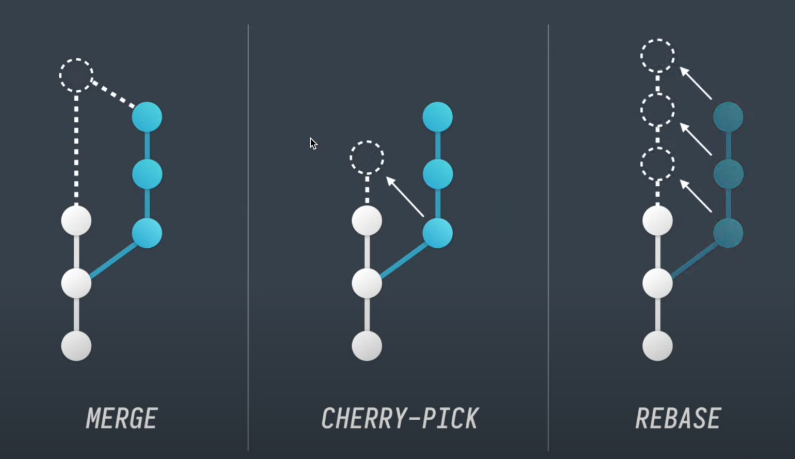
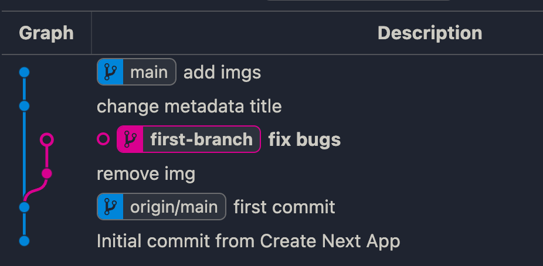
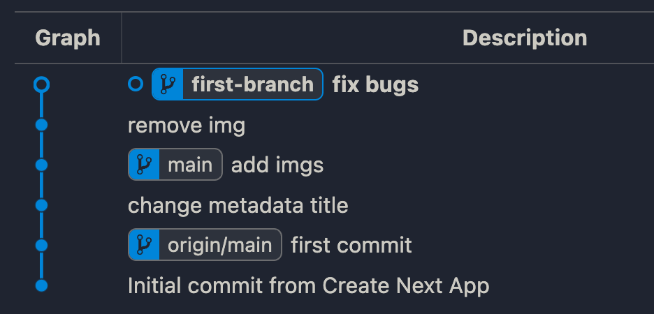
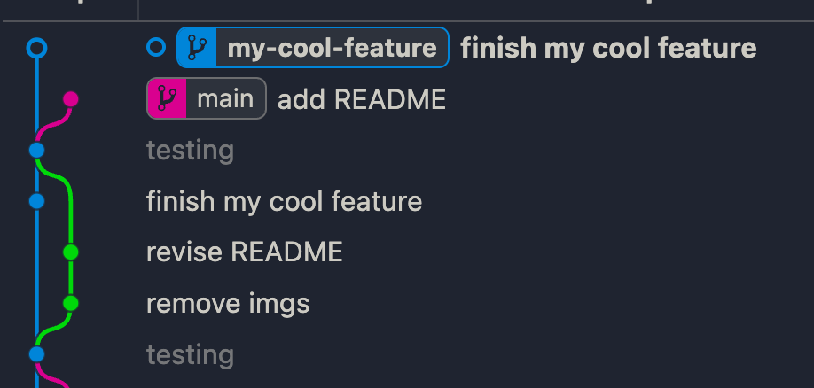

# Git Playground
## Resource
### How git rebase works
![[https://www.youtube.com/watch?v=f1wnYdLEpgI]]
### Difference between git merge, git cherry pick and git rebase
![[https://www.youtube.com/watch?v=i657Bg_HAWI&t=30s]]



### Git merge

## Git Graph
### git rebase
Before

<pre>
```
git rebase main
</pre>
After


### git merge

### After rebase main
<pre>
```
git merge main
</pre>


### git cherry pick

### After rebase main
<pre>
```
git merge main
</pre>
