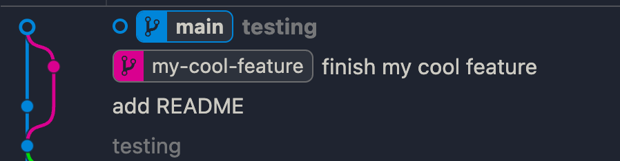

# Git Playground
## Resource
### How git rebase works
![[https://www.youtube.com/watch?v=f1wnYdLEpgI]]
### Difference between git merge, git cherry pick and git rebase
![[https://www.youtube.com/watch?v=i657Bg_HAWI&t=30s]]


### Git merge

## Git Graph
### git rebase
Before

<pre>
```
git rebase main
</pre>
After


### git merge
Before

<pre>
```
git checkout main
git merge my-cool-feature
</pre>
After


### git cherry pick

### After rebase main
<pre>
```
git merge main
</pre>


## Easy mistake
### git merge main vs git merge my-cool-feature
The difference lies in which branch you're currently on and which branch you're merging into it.

🧭 General Rule:
git merge <branch-name>
means: "Merge the changes from <branch-name> into my current branch."

✅ git merge main
You are on another branch, e.g. my-cool-feature, and you want to bring in the latest changes from main.
<pre>
git checkout my-cool-feature
git merge main
</pre>
🟢 Use case: You want to update your feature branch with the latest commits from main before continuing work.

✅ git merge my-cool-feature
You are on the main branch, and you want to bring in the changes from my-cool-feature.
<pre>
git checkout main
git merge my-cool-feature
</pre>
🟢 Use case: Your feature is complete and ready to be merged into main.